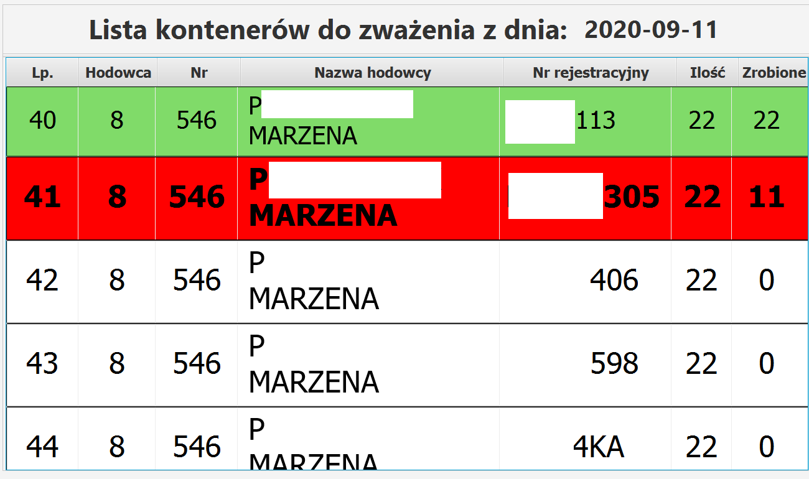

# Aktualny rozładune
>Aplikacja wyświetla aktualną listę aut w kolejce do rozładowania towaru.

## Opis aplikacji

Aplikacja wyświetla w formie tabelki listę samochodów czekających w kolejce. Program komunikuje się z bazą danych MySQL i na podstawie pobranych danych wyświetla informacje na ekranie. Z przyczyn obszernej listy dostawców program wyświetla dane według schematu: jeżeli lista zawiera mniej niż 4 pozycje to pokazuje całą listę w innym wypadku pokazywana lista rozpoczyna się od ostatniego auta, które skończyło rozładunek.

## Użyte technologie
* Java - 1.8
* JavaFX
* SQL

## Przykładowe zdjęcia

